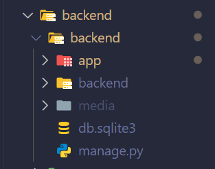
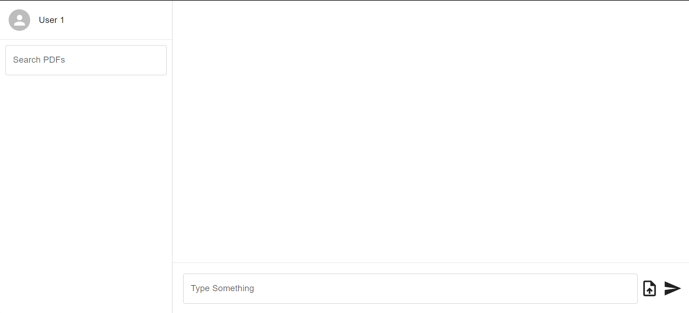
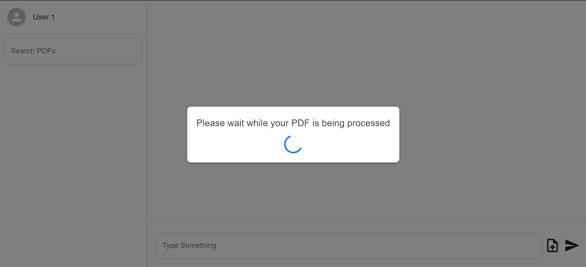
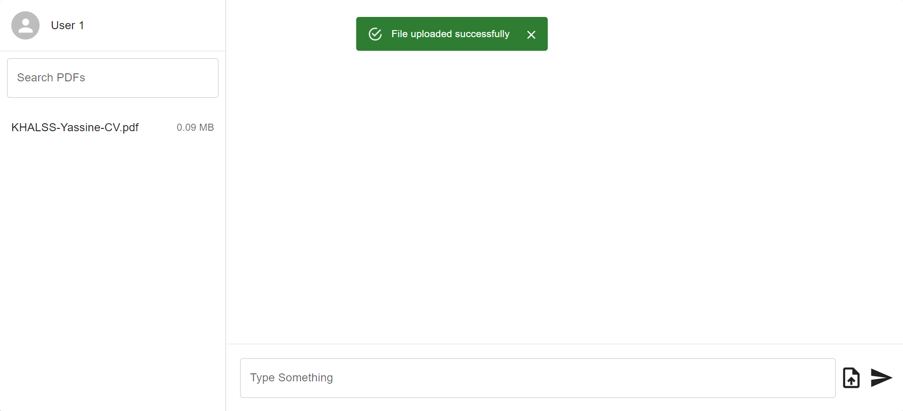
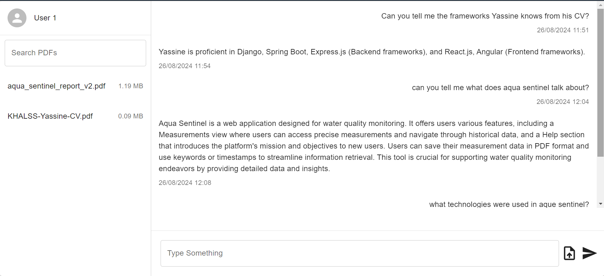
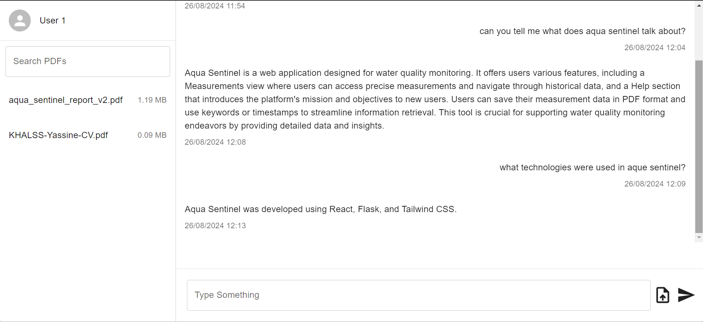

# RAG System for PDF Files

## Overview

This project implements a RAG (Retrieve, Augment, Generate) system for efficient management and processing of PDF files. The frontend is built using React.js, while the backend leverages Python for document processing. Data is stored and managed using PostgreSQL, and a local Mistral LLM (Language Model) is utilized to enhance text generation capabilities. The system integrates seamless interaction between these components to provide a robust solution for PDF management and intelligent document augmentation.

## Features

- **Retrieve:** Allows users to upload and manage PDF files effortlessly.
- **Augment:** Extracts text and metadata from PDFs for deeper analysis and customization.
- **Generate:** Produces concise summaries or transforms the extracted content using advanced language models.

## Technologies Used

- **Frontend:** React.js (version 18.3)
- **Backend:** Django (version 5.1)
- **Database:** PostgreSQL (version 16.3)

## Getting Started

### Prerequisites

- **Node.js** (version 20) and **npm** for frontend development
- **Python** (version 3.11 or higher) for backend development
- **PostgreSQL** (version 16.3) for database management

### Setup

#### Frontend

1. Clone the repository:

   ```bash
   git clone https://github.com/YASSINEKS007/RAG-Sytem-Django-React-js-PostgreSQL.git
   ```

2. Navigate to the frontend directory:

   ```bash
   cd frontend
   ```

3. Install dependencies:

   ```bash
   npm install
   ```

4. Start the development server:

   ```bash
   npm run dev
   ```

   The frontend will be available at [http://localhost:3000](http://localhost:3000).

#### Backend

1. Navigate to the backend directory:

   ```bash
   cd backend
   ```

2. Create and activate a virtual environment:

   ```bash
   virtualenv venv
   ```

   - Activation on Windows:
     ```bash
     venv\Scripts\activate
     ```
   - Activation on macOS or Linux:
     ```bash
     source venv/bin/activate
     ```

3. Install dependencies:

   ```bash
   pip install -r requirements.txt
   ```

4. Create a folder named **media** at the same level as the app and backend directories. Inside media, create another folder called **uploads**. This uploads folder will store the PDFs uploaded from the frontend. The folder structure should look like this:
 

5. Start the backend server:

   ```bash
   python manage.py runserver
   ```

   The backend will be available at [http://localhost:8000](http://localhost:8000).

#### Database Setup

1. **Configure Database Connection:**

   - Edit the `.env` file to configure your PostgreSQL database connection settings.

2. **Set Up PostgreSQL:**

   - Ensure the `pgvector` extension is installed in your PostgreSQL database. Refer to the [pgvector documentation](https://github.com/pgvector/pgvector) for instructions.

3. **Run Database Migrations:**
   - Apply the migrations to set up the database schema:
     ```bash
     python manage.py makemigrations
     ```
     ```bash
     python manage.py migrate
     ```

#### LLM Setup

1.  **Install Mistral:**

- Follow the instructions from [Ollama's website](https://ollama.com) to install Mistral. Ensure it is correctly set up and accessible in your environment.

### Important Note

<div style="background-color: #f8d7da; border-left: 6px solid #f5c6cb; padding: 15px; color: #721c24;">
  <strong>⚠️ Important:</strong><br>
  **Mistral is a local LLM (Large Language Model) that requires significant computing resources.**<br>
  Ensure you have a capable PC, as generating responses may take some time depending on your system's performance.
</div>

### Configuration

#### Frontend

- **File:** `.env`
- **Variable:**
  - `VITE_BACKEND_HOST=`: Set this to the backend host URL.

#### Backend

- **File:** `.env`
- **Variables:**

  - `DJANGO_SECRET_KEY=`: Your Django secret key.
  - `DJANGO_ALLOWED_ORIGINS=`: Comma-separated list of allowed origins for CORS.
  - `DJANGO_ALLOWED_METHODS=`: Comma-separated list of allowed HTTP methods (e.g., GET, POST).
  - `DJANGO_ALLOWED_HEADERS=`: Comma-separated list of allowed headers.

  - **Database Configuration:**
    - `DB_NAME=`: Name of the PostgreSQL database.
    - `DB_USER=`: Username for the PostgreSQL database.
    - `DB_PASSWORD=`: Password for the PostgreSQL database.
    - `DB_HOST=`: Host of the PostgreSQL database server.
    - `DB_PORT=`: Port number for the PostgreSQL database server.

## Usage

1. **Upload PDF Files:** Use the frontend interface to upload PDF files. The backend will process these files, extract text, and generate embeddings, which are then stored in PostgreSQL.

2. **Index Data:** The extracted data and embeddings are indexed in a way that allows efficient retrieval. This involve using a vector store to facilitate similarity search.

3. **Retrieve Data:**  When a query is made, the system retrieves relevant documents or data from the indexed storage based on similarity to the query or context.

4. **Generate Responses:** The retrieved data is used to generate or augment responses. This involve combining the retrieved information with the generative model Mistral to produce coherent and contextually relevant outputs.

5. **Display Outputs:** The generated responses or summaries are sent to the frontend for display to the user.

## Screenshots

- **Main Page**
  

  - Overview of the main chat application interface, where users interact with the system.

- **Upload PDF**
  

  - Users can upload a PDF and wait for the server to process it before starting interactions.

- **Process Success**
  

  - Success confirmation snackbar indicating that the PDF file has been successfully uploaded and processed.

- **Chat 1**
  

  - Initial example of a chat session where the processed PDF content is used in the conversation.

- **Chat 2**
  
  - Continuation of the chat session, showcasing further interaction and functionality with the processed PDF content.

## Contributing

Contributions are welcome! Please fork the repository and submit a pull request with your changes.

## License

This project is licensed under the MIT License - see the [LICENSE](LICENSE) file for details.

## Contact

For any questions or issues, please contact [yassinekh007007@gmail.com].
